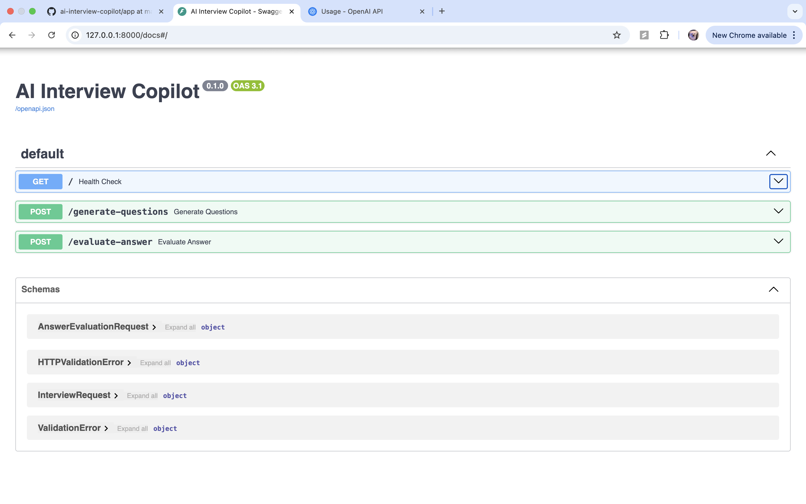
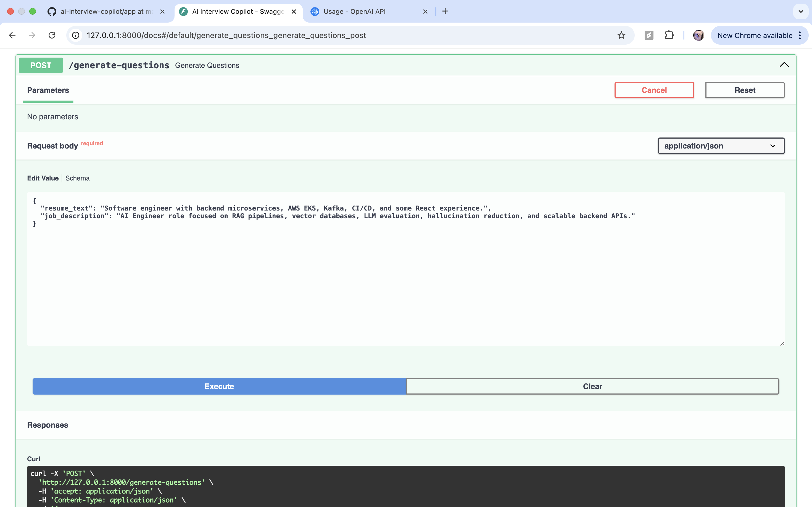
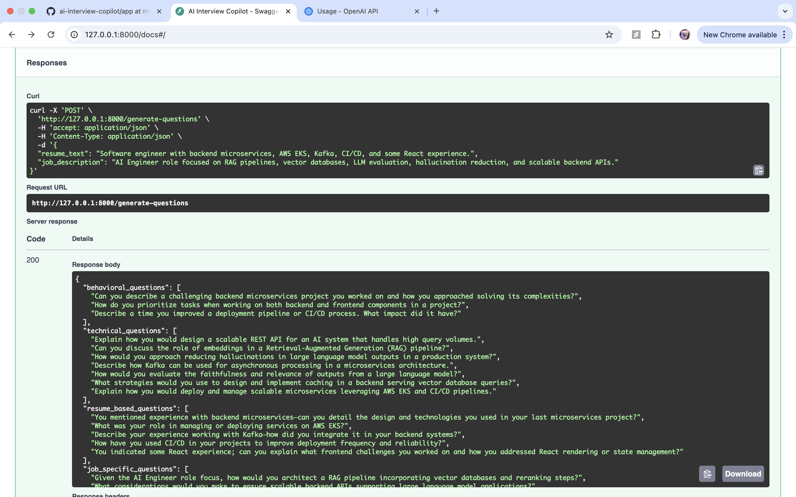
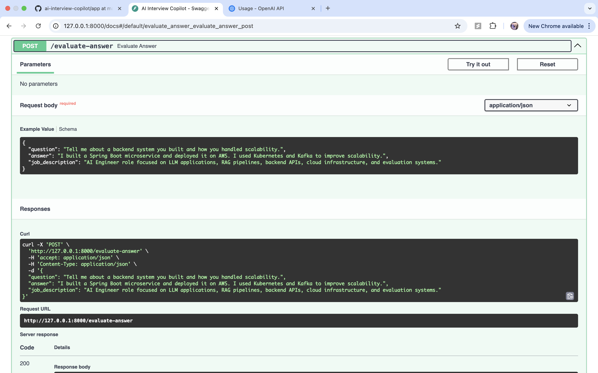
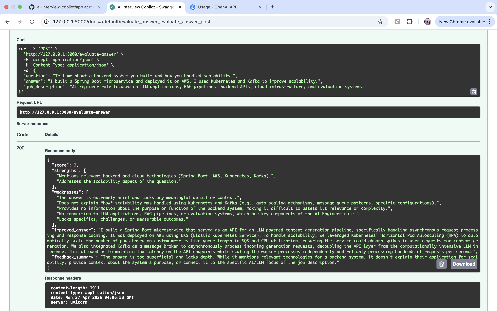

# AI Interview Copilot

A RAG-based AI interview coaching backend that generates personalized interview questions and evaluates candidate answers based on a resume and job description.

This project is designed as a production-style AI application backend using FastAPI, OpenAI, ChromaDB, embeddings, and reranking.

---

## Features

- Generate tailored interview questions from a resume and job description
- Evaluate candidate answers with structured feedback
- Retrieve relevant interview knowledge using RAG
- Retrieve relevant resume context based on the job description
- Use cross-encoder reranking to improve retrieval quality
- Return structured JSON responses
- Include logging for retrieval and reranking behavior

---

## Tech Stack

- Python
- FastAPI
- OpenAI API
- ChromaDB
- SentenceTransformers
- CrossEncoder reranker
- Pydantic
- Uvicorn

---

## Architecture

```text
User / Swagger UI
        |
        v
FastAPI Backend
        |
        v
main.py
API Layer
        |
        v
llm_service.py
LLM Orchestration Layer
        |
        +-----------------------------+
        |                             |
        v                             v
rag_service.py                 OpenAI API
Retrieval Layer                Structured JSON Generation
        |
        v
Embedding Model
SentenceTransformer
        |
        v
ChromaDB Vector Store
        |
        v
Top-k Retrieval
        |
        v
CrossEncoder Reranker
        |
        v
Relevant Context
        |
        v
Prompt Construction
        |
        v
Structured JSON Response
````

---

## RAG Pipeline

The system uses a multi-source RAG pipeline.

### 1. Knowledge Base Retrieval

Reusable interview knowledge is stored in:

```text
data/interview_knowledge.md
```

The file is split into chunks, embedded, and stored in ChromaDB.

At query time, the system retrieves relevant interview knowledge such as:

* RAG concepts
* Backend questions
* System design topics
* Evaluation criteria

### 2. Resume-Based Retrieval

The resume is treated as runtime input.

The system chunks the resume, embeds each chunk, and retrieves the most relevant resume sections using the job description as the query.

This allows the same resume to generate different interview questions for different job descriptions.

### 3. Reranking

After vector retrieval, the system applies a CrossEncoder reranker to improve relevance.

```text
Vector Search top-k
        |
        v
CrossEncoder Reranking
        |
        v
Best Context Chunks
```

---

## API Endpoints

### Health Check

```http
GET /
```

Response:

```json
{
  "status": "ok",
  "message": "AI Interview Copilot is running"
}
```

---

### Generate Interview Questions

```http
POST /generate-questions
```

Request:

```json
{
  "resume_text": "Software engineer with Java, Spring Boot, AWS, Kubernetes, Kafka, and microservices experience.",
  "job_description": "AI Engineer role focused on building LLM applications, RAG pipelines, backend APIs, and evaluation systems."
}
```

Response:

```json
{
  "behavioral_questions": [
    "Tell me about a time you had to learn a new technology quickly and apply it in a project."
  ],
  "technical_questions": [
    "How would you design a scalable backend API for an LLM-powered application?"
  ],
  "resume_based_questions": [
    "How would you apply your Spring Boot and AWS experience to building an AI interview coaching system?"
  ],
  "job_specific_questions": [
    "How would you design a RAG pipeline for generating role-specific interview questions?"
  ]
}
```

---

### Evaluate Interview Answer

```http
POST /evaluate-answer
```

Request:

```json
{
  "question": "How would you design a scalable backend API for an LLM-powered application?",
  "answer": "I would use FastAPI, add a service layer for LLM calls, use caching, add retries, and monitor latency.",
  "job_description": "AI Engineer role focused on LLM applications, RAG pipelines, backend APIs, and evaluation systems."
}
```

Response:

```json
{
  "score": 8,
  "strengths": [
    "Mentions API design and service separation",
    "Considers caching, retry handling, and latency"
  ],
  "weaknesses": [
    "Could explain retrieval and evaluation more clearly",
    "Could include security and cost considerations"
  ],
  "improved_answer": "I would design a FastAPI backend with a clear API layer, LLM orchestration layer, and retrieval layer. I would add caching, retry logic, structured JSON outputs, logging, and evaluation metrics to monitor answer quality, latency, and cost.",
  "feedback_summary": "Strong answer with good backend awareness. It would be stronger with more AI-specific system design details."
}
```

---

## Project Structure

```text
ai-interview-copilot/
├── app/
│   ├── main.py
│   ├── llm_service.py
│   ├── rag_service.py
│   └── logger.py
├── data/
│   └── interview_knowledge.md
├── .env.example
├── .gitignore
├── requirements.txt
└── README.md
```

---

## Local Setup

### 1. Clone the repository

```bash
git clone https://github.com/ruoyali7/ai-interview-copilot.git
cd ai-interview-copilot
```

### 2. Create virtual environment

```bash
python3 -m venv venv
source venv/bin/activate
```

### 3. Install dependencies

```bash
python -m pip install -r requirements.txt
```

### 4. Create `.env`

```bash
cp .env.example .env
```

Add your OpenAI API key:

```env
OPENAI_API_KEY=your_openai_api_key_here
OPENAI_MODEL=gpt-4.1-mini
```

### 5. Run the server

```bash
python -m uvicorn app.main:app --reload
```

Open Swagger UI:

```text
http://127.0.0.1:8000/docs
```

---

## Demo Screenshots

### Swagger UI



### Generate Questions




### Evaluate Answer




---

## Engineering Highlights

* Built a FastAPI backend to expose LLM functionality as REST APIs
* Implemented a multi-source RAG pipeline using knowledge base retrieval and resume retrieval
* Used ChromaDB for embedding-based vector search
* Added CrossEncoder reranking to improve retrieval relevance
* Used structured JSON output for predictable API responses
* Added logging for retrieval, reranking, and API debugging
* Designed the system to be modular with separate API, LLM, and retrieval layers

---

## Future Improvements

* Add persistent ChromaDB storage
* Add frontend UI
* Add user authentication
* Add response caching to reduce cost and latency
* Add automated evaluation metrics
* Add Docker support
* Add GitHub Actions CI
* Add tool calling for job market or company-specific interview insights

